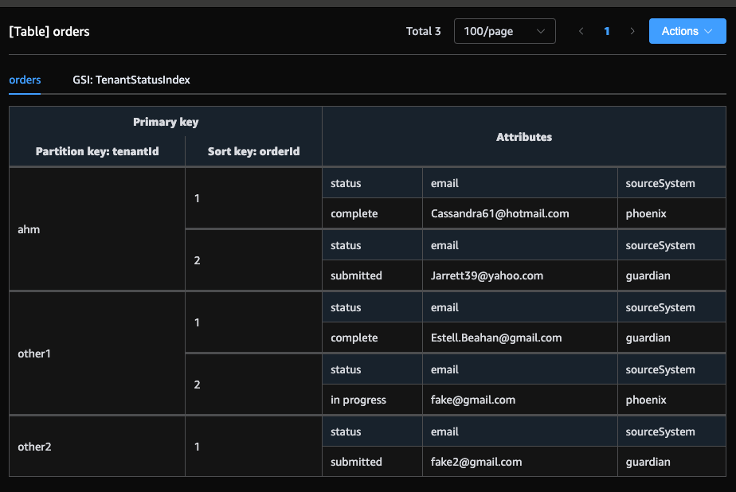

| Access Pattern | Partition Key (PK) | Sort Key (SK) | Index Name | Notes |
|---------------|-------------------|--------------|------------|-------|
| Retrieve all orders for a tenant | `<TenantId>` | `<OrderId>` | — | Base table query. Efficient for fetching all orders per tenant. |
| Retrieve orders by status for a tenant | `<TenantId>` | `<Status>` | `TenantStatusIndex` (LSI) | Enables filtering by order status within a tenant. |



WIP Example:
```json
{
  "ModelName": "Phoenix Orders",
  "ModelMetadata": {
    "Author": "",
    "DateCreated": "Apr 19, 2025, 06:28 AM",
    "DateLastModified": "Apr 19, 2025, 06:45 AM",
    "Description": "",
    "AWSService": "Amazon DynamoDB",
    "Version": "3.0"
  },
  "DataModel": [
    {
      "TableName": "orders",
      "KeyAttributes": {
        "PartitionKey": {
          "AttributeName": "tenantId",
          "AttributeType": "S"
        },
        "SortKey": {
          "AttributeName": "orderId",
          "AttributeType": "S"
        }
      },
      "NonKeyAttributes": [
        {
          "AttributeName": "status",
          "AttributeType": "S"
        },
        {
          "AttributeName": "email",
          "AttributeType": "S"
        },
        {
          "AttributeName": "sourceSystem",
          "AttributeType": "S"
        },
        {
          "AttributeName": "lastUpdatedBy",
          "AttributeType": "S"
        }
      ],
      "TableFacets": [],
      "GlobalSecondaryIndexes": [
        {
          "IndexName": "TenantStatusIndex",
          "KeyAttributes": {
            "PartitionKey": {
              "AttributeName": "tenantId",
              "AttributeType": "S"
            },
            "SortKey": {
              "AttributeName": "status",
              "AttributeType": "S"
            }
          },
          "Projection": {
            "ProjectionType": "ALL"
          }
        }
      ],
      "TableData": [
        {
          "tenantId": {
            "S": "ahm"
          },
          "orderId": {
            "S": "1"
          },
          "status": {
            "S": "complete"
          },
          "email": {
            "S": "Cassandra61@hotmail.com"
          },
          "sourceSystem": {
            "S": "phoenix"
          }
        },
        {
          "tenantId": {
            "S": "ahm"
          },
          "orderId": {
            "S": "2"
          },
          "status": {
            "S": "submitted"
          },
          "email": {
            "S": "Jarrett39@yahoo.com"
          },
          "sourceSystem": {
            "S": "guardian"
          }
        },
        {
          "tenantId": {
            "S": "other1"
          },
          "orderId": {
            "S": "1"
          },
          "status": {
            "S": "complete"
          },
          "email": {
            "S": "Estell.Beahan@gmail.com"
          },
          "sourceSystem": {
            "S": "guardian"
          }
        },
        {
          "tenantId": {
            "S": "other1"
          },
          "orderId": {
            "S": "2"
          },
          "status": {
            "S": "in progress"
          },
          "email": {
            "S": "fake@gmail.com"
          },
          "sourceSystem": {
            "S": "phoenix"
          }
        },
        {
          "tenantId": {
            "S": "other2"
          },
          "orderId": {
            "S": "1"
          },
          "status": {
            "S": "submitted"
          },
          "email": {
            "S": "fake2@gmail.com"
          },
          "sourceSystem": {
            "S": "guardian"
          }
        }
      ],
      "DataAccess": {
        "MySql": {}
      },
      "SampleDataFormats": {
        "status": [
          "dataTypes",
          "String"
        ],
        "orderId": [
          "dataTypes",
          "String"
        ],
        "tenantId": [
          "dataTypes",
          "String"
        ],
        "email": [
          "identifiers",
          "Email"
        ],
        "sourceSystem": [
          "dataTypes",
          "String"
        ],
        "lastUpdatedBy": [
          "identifiers",
          "Username"
        ]
      },
      "BillingMode": "PAY_PER_REQUEST"
    }
  ]
}
```


